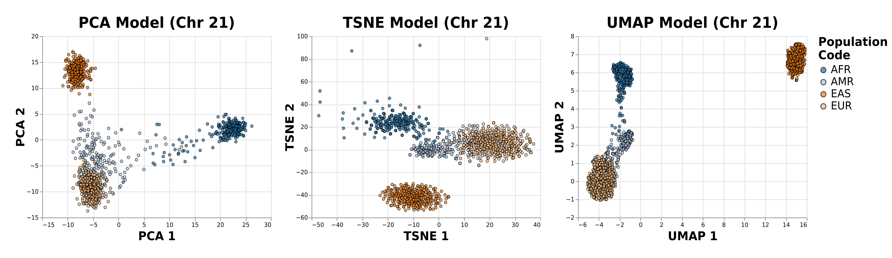

# Data Analysis Projects

---

## 1. Car EDA & Price Prediction

Link to Notebook: https://github.com/ryanirl/data-analysis-projects/blob/main/car_price_prediction/car_price_prediction.ipynb

Notebook covering the data gathering, cleaning, EDA, feature engineering, and
model prediction of automobile prices. This project was inspired by my first
every python project (https://github.com/ryanirl/CraigslistScraper), though the
actual dataset used in the notebook is a kaggle dataset found here:
https://www.kaggle.com/austinreese/craigslist-carstrucks-data. Big shout out to
Austin Reese for taking the time to compile this dataset and make it public as
it contains 400,000+ craigslist ads. Random Forest Regressor (vanilla) was the
best performing model and managed to achieve an R2 Score of 0.931. 

**Models Evaluated & Performance:**

| Model                   | MAE Score | R2 Score |
| ----------------------- | --------- | -------- |
| Random Forest Regressor | 1570.125  | 0.931    |
| XGBoost Regressor       | 2368.176  | 0.902    |
| LightGBM Regressor      | 2629.613  | 0.886    |
| K-Nearest Regressor     | 2973.658  | 0.829    |
| Linear Regression       | 3989.318  | 0.794    |

 

**Dependencies:** Pandas, Numpy, Seaborn, Matplotlib, XGBoost, LightGBM,
SKLearn, SciPy, and categorical_encoders 

 

---

## 2. Cell Instance Segmentation

**WORK IN PROGRESS**

Link to Repo: https://github.com/ryanirl/data-analysis-projects/blob/main/cell_instance_segmentation

### Evaluation Metric:

We evaluate the Precision of the IoU at different thresholds in the range 
[0.5, 0.95] with a step size of 0.05, and then took the Mean Average of 
each Precision to get the MAP IoU Score. 

NOTES: To understand the low AP scores at an IoU threshold of 0.9 consider 
reading this discussion:
https://www.kaggle.com/c/sartorius-cell-instance-segmentation/discussion/281205

**Scores:**

| Model                 | AP @ IoU 0.5 | AP @ IoU 0.75 | AP @ IoU 0.9 | MAP IoU @ [0.5, 0.95] | LB Public | 
| --------------------- | --------------- | ---------------- | --------------- | ------------------------ | --------- | 
| Mask R-CNN R50-FPN    | 0.5644          | 0.2650           | 0.0125          | 0.2893                   | 0.306     | 
| CellPose w/ SizeModel | 0.6187          | 0.2491           | 0.0103          | 0.2975                   | 0.312     | 

**Cell Specific Scores (CV):**

| Model                 | Cort   | SH-SY5Y | Astrocyte | 
| --------------------- | ------ | ------- | --------- |
| Mask R-CNN R50-FPN    | 0.3869 | 0.1879  | 0.1914    | 
| CellPose w/ SizeModel | 0.3924 | 0.2274  | 0.1865    |

 

**Dependencies:** Pandas, Numpy, Matplotlib, SKLearn, SciPy, detectron2,
PyYAML, cv2, PyTorch, pycocotools, fastcore, joblib, and tqdm.

---

# Dimensionality Reduction on Genotypes

**WORK IN PROGRESS**

    

The goal of this project is to use common dimensionality reduction techniques
such as PCA, t-SNE, and UMAP to infer ancestery from individuals genotype.
Data is given in the form of a VCF (Variant Call Format) file containing
variants such as single nucleotide polymorphism's (SNP's), insertion/deletions 
(INDEL's), and more. 

---

<!-- LICENSE -->
## License

Distributed under the MIT License. See `LICENSE` for more information.

 

