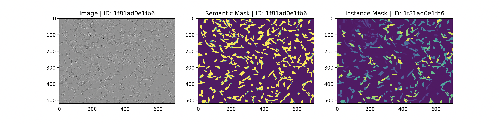
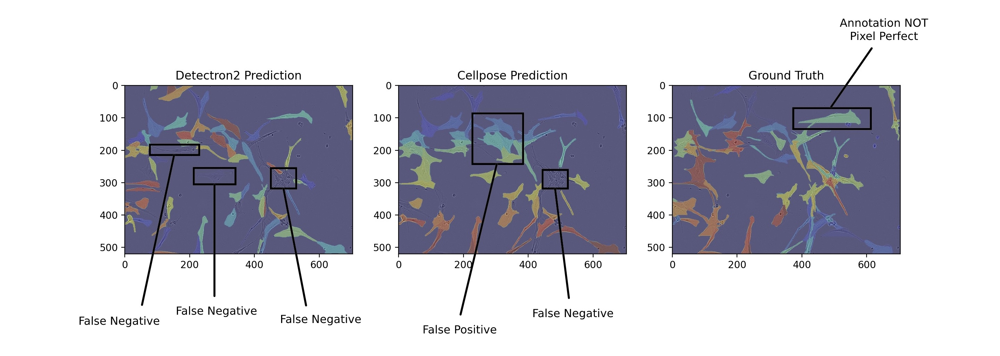
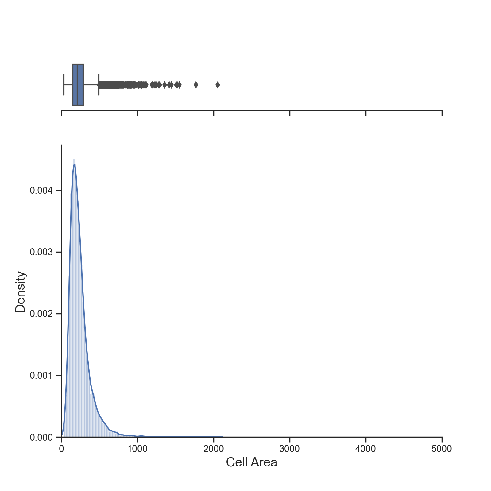
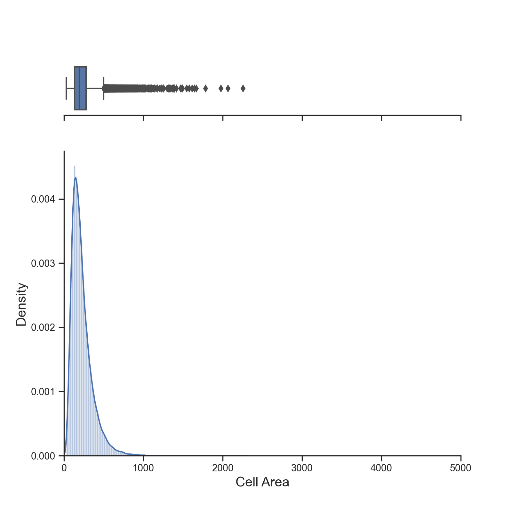
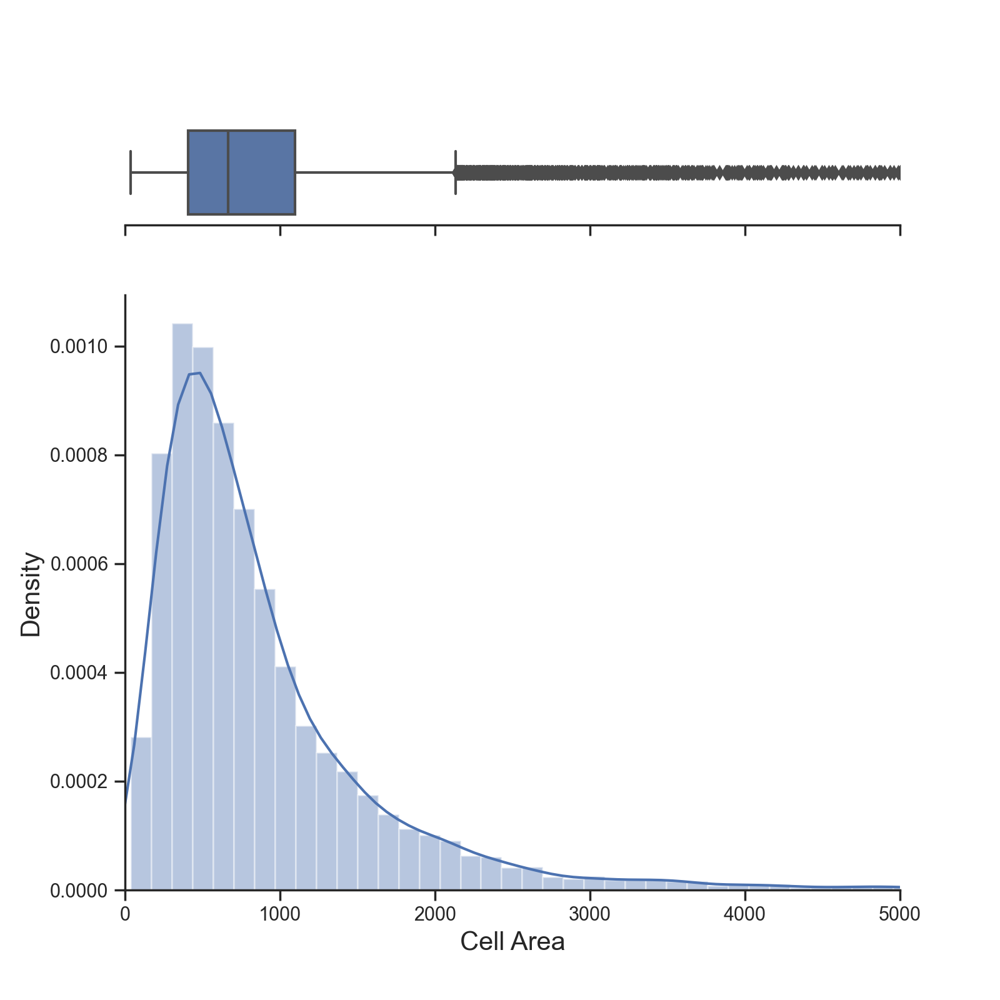
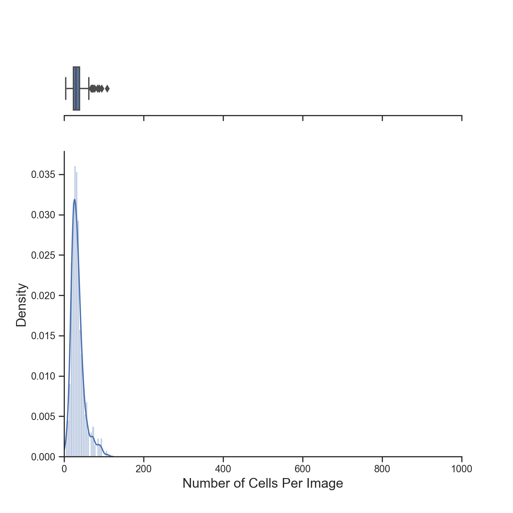
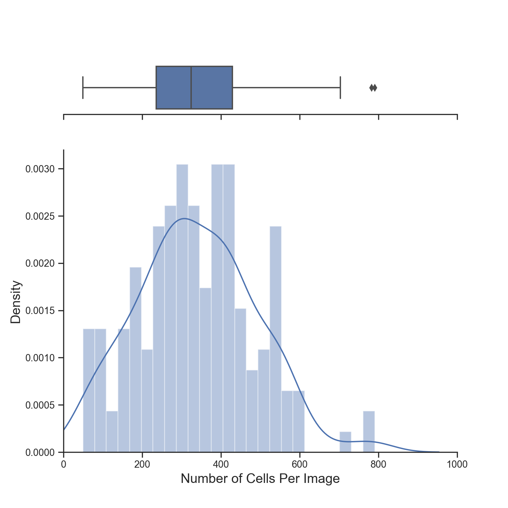
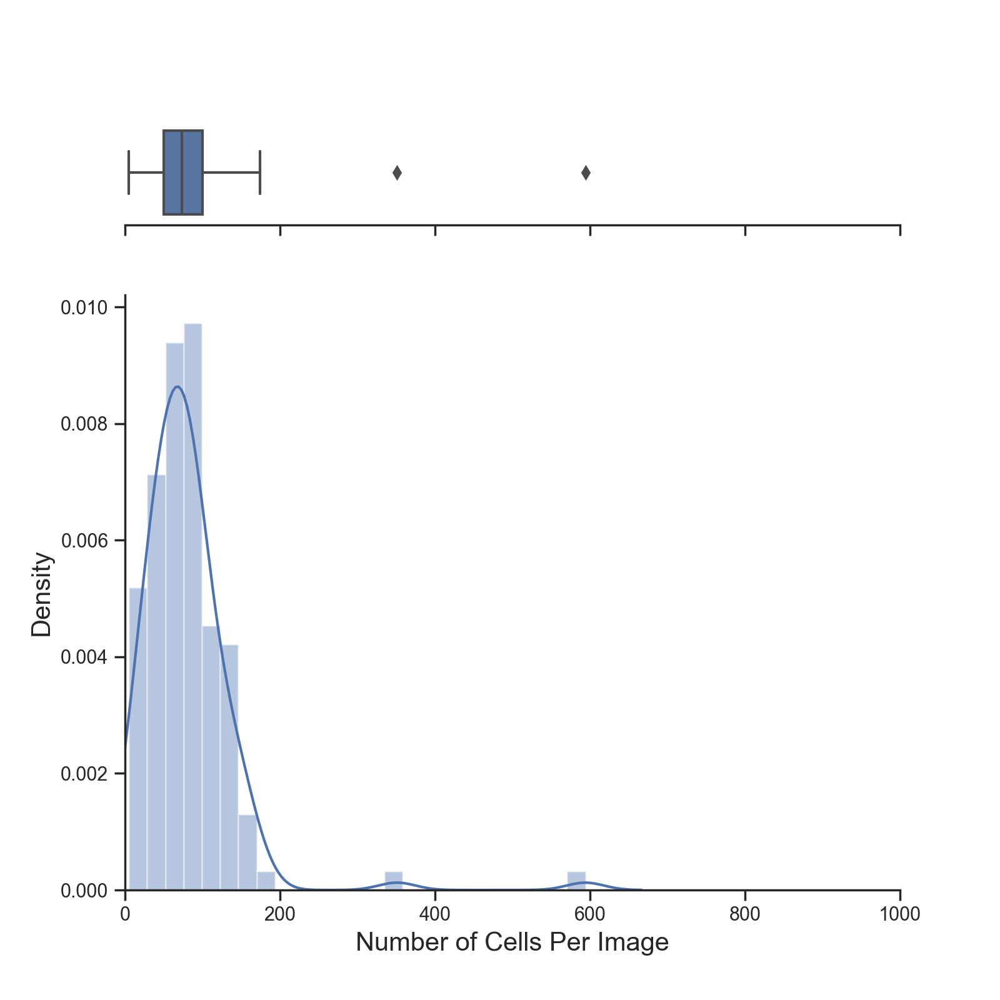
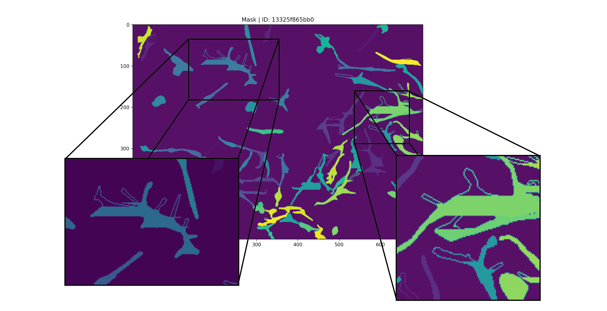
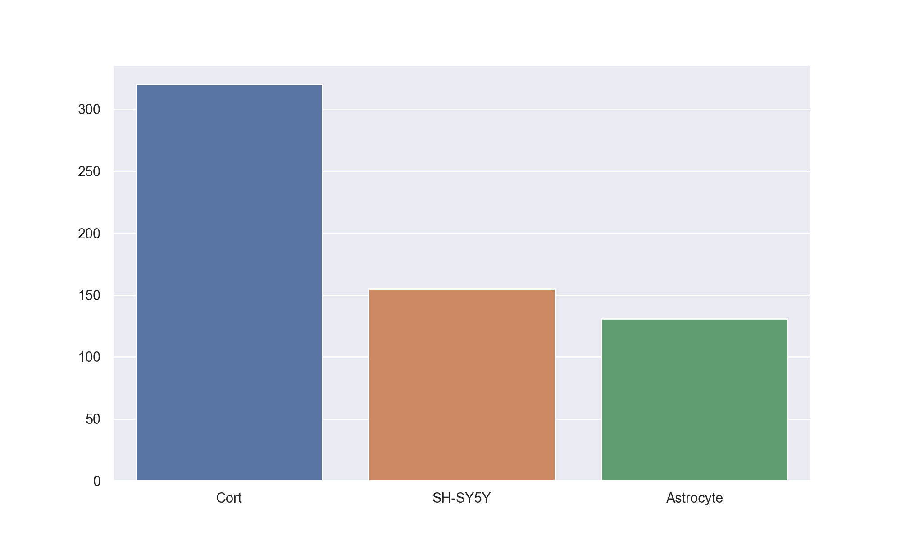

# Cell Instance Segmentation

Cell instance segmentation is the segmentation and detection of individual
cells (see image below). One possible application where this can be particularly 
useful is for studying how particular cells may or may not react to various
treatments. However, segmenting instances of cells accurately by hand is a
tedious and time-consuming task.

This project follows from the "Sartorius Cell Instance Segmentation" Kaggle
competition, and aims to benchmark and analyzes current SOTA instance 
segmentation methods against the task of accurately segmenting and detecting
individual cells.

<!-- TABLE OF CONTENTS -->
## Table of Contents
* [Summary](#Summary)
    * [Models Evaluated & Performance](#models-evaluated-and-performance)
    * [Key Findings](#key-findings0)
* [Competition Information](#information)
    * [Data](#data)
    * [Training Information](#training-information)
    * [Winning Solutions](#winning-solutions)
* [References](#references)
* [License](#license)

Follows from the Kaggle competition here:
https://www.kaggle.com/c/sartorius-cell-instance-segmentation

**Dependencies:** Pandas, Numpy, Matplotlib, SKLearn, SciPy, Detectron2,
PyYAML, cv2, Cellpose, PyTorch, pycocotools, fastcore, joblib, and tqdm.

---

<!-- Summary -->
## Summary 

<!-- Models Evaluated and Performance -->
### Models Evaluated & Performance

More detailed tables of my Model Performance can be found 
[here](https://github.com/ryanirl/data-analysis-projects/blob/main/cell_instance_segmentation/MODEL_PERFORMANCE.md):

#### Evaluation Metric:

We evaluate the Precision of the IoU at different thresholds in the range 
[0.5, 0.95] with a step size of 0.05, and then took the Mean Average of 
each Precision to get the MAP IoU Score. 

**Side Note:** To understand the low AP scores at an IoU threshold of 0.9 consider 
reading this discussion: 
https://www.kaggle.com/c/sartorius-cell-instance-segmentation/discussion/281205 

#### Model Scores:

| Model                 | AP @ IoU 0.5 | AP @ IoU 0.75 | AP @ IoU 0.9 | MAP IoU @ [0.5, 0.95] | LB Public | 
| --------------------- | --------------- | ---------------- | --------------- | ------------------------ | --------- | 
| Mask R-CNN R50-FPN    | 0.5644          | 0.2650           | 0.0125          | 0.2893                   | 0.306     | 
| CellPose w/ SizeModel | 0.6187          | 0.2491           | 0.0103          | 0.2975                   | 0.312     | 

#### Cell Specific Scores (CV):

| Model                 | Cort   | SH-SY5Y | Astrocyte | 
| --------------------- | ------ | ------- | --------- |
| Mask R-CNN R50-FPN    | 0.3869 | 0.1879  | 0.1914    |
| CellPose w/ SizeModel | 0.3924 | 0.2274  | 0.1865    |

**Side Note:** Though in my analysis I only show the IoU Score at an AP of [0.5, 0.75, 0.9], the public LB 
is calculated through MAP's of [0.5, 0.55, ..., 0.9, 0.95], I just didn't feel the need to list each one in 
my analysis.

#### Sample Predictions:

---

<!-- Key Findings -->
### Key Findings & Analysis: 

*WORK IN PROGRESS*

Expand each key finding for a detailed analysis of each. 

#### Model Performance Findings:

   
Accurate BBox Proposals are KEY:

According to takuoko and tascj, the team of 2 who placed 1st: "We decided to 
build a solution using box-based instance segmentation, and focus more on the
bbox detection part. We think the mask prediction performance is mainly limited
by annotation quality so we did not pay much attention to it." [[1]](#1). For 
the task of Cell Instance Segmentation, I believe this is a key insight. When 
predicting a small amount of low density large objects, such as a person or cat 
in the center of the frame, I belive it's the mask prediction that can often lack
behind often not having pixel perfect borders. But, given the small and high density 
nature of these cell populations, a single vanilla ResNet50 based Mask R-CNN severely 
lacks in its ability to generate accurate BBox's do to its exhaustive Anchor Generating 
nature. For BBox proposals, the top 2 winning solutions [[1]](#1) [[2]](#2) both used 
multiple, non-exhaustive BBox Heads (such as YOLOX) followed by a Weighted Box Fusion 
(WBF) ensemble. 

---

#### EDA Findings:

   
Cell Size and Count:

| Cell Size    | Cort                                | SH-SY5Y                               | Astocytes                            |
| ------------ | ----------------------------------- | ------------------------------------- | ------------------------------------ |
| Distribution |  |  |  |
| Count        | 10777.00                            | 52286.00                              | 10522.00                             |
| Mean         | 240.16                              | 224.50                                | 905.81                               |
| STD          | 139.17                              | 133.94                                | 855.19                               |
| Min          | 33.00                               | 30.00                                 | 37.00                                |
| Max          | 2054.00                             | 2254.00                               | 13327.00                             |

| Cell Count   | Cort                                 | SH-SY5Y                                | Astocytes                             |
| ------------ | ------------------------------------ | -------------------------------------- | ------------------------------------- |
| Distribution |  |  |  |
| Count        | 320.00                               | 155.00                                 | 131.00                                |
| Mean         | 33.68                                | 337.33                                 | 80.32                                 |
| STD          | 16.50                                | 149.60                                 | 64.13                                 |
| Min          | 4.00                                 | 49.00                                  | 5.00                                  |
| Max          | 108.00                               | 790.00                                 | 594.00                                |

---

   
Annotations are NOT Pixel Perfect:

As highlighted above, although mask prediction may be largely limited by
annotation quality. A few of the Astrocyte annoations are not pixel perfect and
some I would even consider potentially damaging to a models perforance. The
main recuring problem I saw with astrocyte masks was that some were hollow. 
Though in my non-professional opinion there were a couple images that seemed
to be missing signifacant annotations (see ID: 3bcc8ba1dc17). As an example
of an image with hollow artifacts:

    

This lead some people to try and *clean* these astro masks [[4]](#4). Though
one problem discussed is that if these problems lie in the training set then they also
probably lie in the competition testing set. That said, I never tried training
with a *cleaned* set but I do wonder what kind of perforance gains one might see 
if they spent a day meticulously going through and re-drawing each Astro mask
by hand with near pixel perfect borders.

Another noteable problem with the masks not being pixel perfect is how strict
the MAP IoU metric is at a threshold of above ~0.85. Though I will refer you 
to this Kaggle post that describes the problem very nicely:
https://www.kaggle.com/c/sartorius-cell-instance-segmentation/discussion/281205 [[3]](#3)

Some image ids with hollow artifacts or *potential* missing masks:
- 3bcc8ba1dc17
- 174793807517
- 13325f865bb0
- 182c3da676bd

---

   
There is an Uneven Distribution of Cell Types:

In the training set there are 320 Cort (~52.81%), 155 SH-SY5Y (~25.58%), and 131 (~21.62%) Astro cell images. 
My model performance on each cell type can be seen here: 

    

| Model                 | Cort   | SH-SY5Y | Astrocyte | MAP IoU @ [0.5, 0.95] | LB Public |
| --------------------- | ------ | ------- | --------- | ------------------------ | --------- |
| Mask R-CNN R50-FPN    | 0.3869 | 0.1879  | 0.1914    | 0.2893                   | 0.306     |
| CellPose w/ SizeModel | 0.3924 | 0.2274  | 0.1865    | 0.2975                   | 0.312     |

Both models performed much better on the Cort cell line than the SH-SY5Y and Astro cell line. Also, both my
models had a positive LB correlation (roughly about +0.015) leading me to believe there *might* (pure specalation
here) be a larger distribution of the Cort cell type in the private testing data than our training data. As seen
by comments in this post [[5]](#5) many people were also experiencing strong positive LB correlation (some people 
were even getting upwards of 0.03 gains). 

---

---

<!-- Information -->
## Competition Information:
* [Data](#data)
* [Training Information](#training-information)
* [Winning Solutions](#winning-solutions)

---

<!-- DATA -->
### Data:

Data in this competition was given in the form of Testing, Training, Train Semi
Supervised and LIVECELL Data. 

The Training, Testing, and Train Semi Supervised data consist of 3 cell types:
1. Astroctyes ("astro")
2. SH-SY5Y ("shsy5y")
3. Cort ("cort")

Though in this competition we're only tested on the 3 cell types listed above, the predecessor
to competition dataset, the LIVECELL dataset, is also given and contains 8 Cell Types. Of the 8 
extra cell lines, the only one that overlaps with the training data is the SH-SY5Y cell line. 
The SH-SY5Y data in the LIVECELL Dataset IS seperate from the data we are given in the competition. 
The other 7 Cell Types in the LIVECELL Data are:
1. A172
2. BT474
3. BV-2
4. Huh7
5. MCF7
6. SkBr3
7. SK-OV-3

The extra data in the LIVECELL dataset will almost surely be utilized in training to 
acheive high scores, some ideas include:
1. Combining the addition data from the SH-SY5Y cell line in the LIVECELL dataset.
2. First Training on the larger LIVECELL dataset then Transer Learning that model to 
the original training set. 

---

<!-- Training Information -->
### Training Information:

**Mask R-CNN R50 FPN:**

Each trained multiple models, here are details about my highest performing model. Each model was first trained
on the LIVECELL Dataset then transfered to the smaller Sartorius Dataset. This gave me a 2% improvement overall
from models that weren't first trained on LIVECELL.

**Training Details:**
- Epochs: 100 -> 50 (100 on LIVECELL -> 50 on Sartorius)
- Batch Size: 2
- LR: 0.0005
- Resize Max Size: 1333 (default)
- Resize Min Size: (640, 672, 704, 736, 768, 800) (default)
- Anchor Generator Size: [[32], [64], [128], [256], [512]] (default)
- N Classes: 8 -> 3 
- Detections per Image: 1000

**Inference Details:**

- Custom NMS: 
    - Astrocyte: 0.4
    - SH-SY5Y: 0.25
    - Cort: 0.7

- Custom Score Thresholding: 
    - Astrocyte: 0.4 
    - SH-SY5Y: 0.15
    - Cort: 0.55

- Custom Per Pixel Score Thresholding: 
    - Astrocyte: 0.45
    - SH-SY5Y: 0.5
    - Cort: 0.45

**See here for more details:**

Training: https://github.com/ryanirl/data-analysis-projects/blob/main/cell_instance_segmentation/src/d2_train.py

Inferance: https://github.com/ryanirl/data-analysis-projects/blob/main/cell_instance_segmentation/src/detectron2_src/d2_config.yaml

---

<!-- Winning Solutions -->
### Winning Solutions:

Here are links to winners explanation of their models and solutions:

1. *todo*

---

<!-- References -->
## References:

<a id = "1">[1]</a>: takuoko (Jan. 2022). "1st place solution". *Kaggle*. https://www.kaggle.com/c/sartorius-cell-instance-segmentation/discussion/298869

<a id = "2">[2]</a>: nvnn (Dec. 2021). "2nd place solution. *Kaggle*. "https://www.kaggle.com/c/sartorius-cell-instance-segmentation/discussion/297988

<a id = "3">[3]</a>: Theo Viel (Nov. 2021). "Annotations Are too Noisy for the Metric". *Kaggle*. https://www.kaggle.com/c/sartorius-cell-instance-segmentation/discussion/281205

<a id = "4">[4]</a>: hengck23 (Nov. 2021). "The clean astro mask are here!!!". *Kaggle*. https://www.kaggle.com/c/sartorius-cell-instance-segmentation/discussion/291371

<a id = "5">[5]</a>: Sirius (Nov. 2021). "Best Single Model". *Kaggle*. https://www.kaggle.com/c/sartorius-cell-instance-segmentation/discussion/289033

---

<!-- LICENSE -->
## License

Distributed under the MIT License. See `LICENSE` for more information.

 

