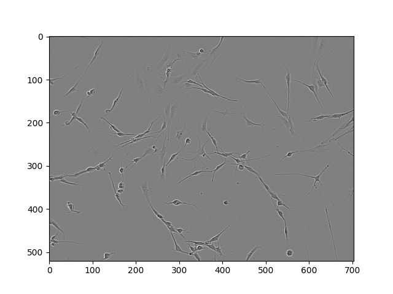
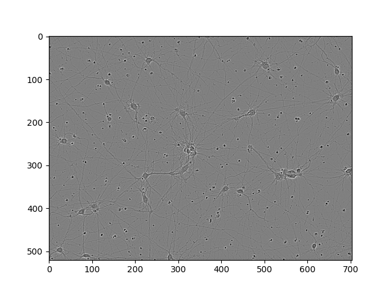
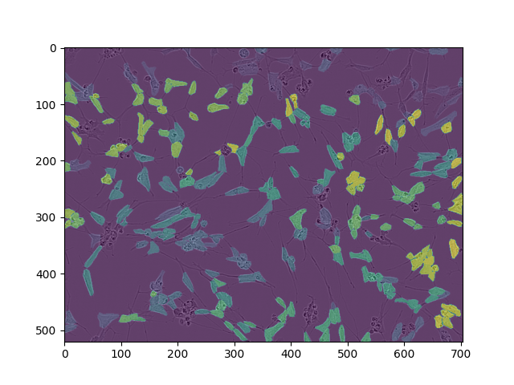
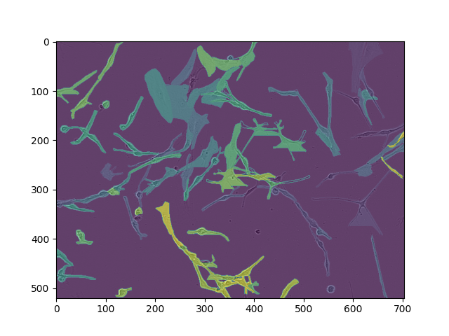
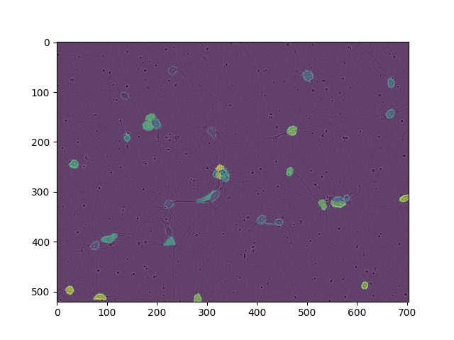
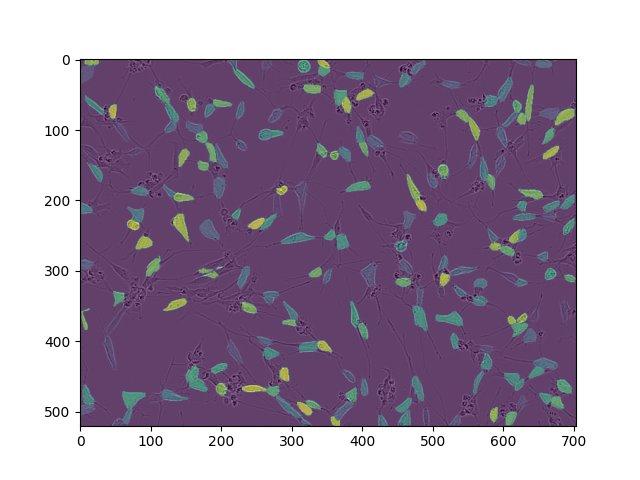
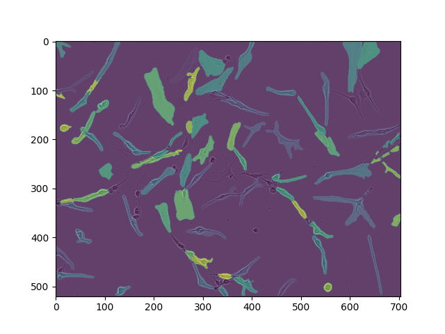
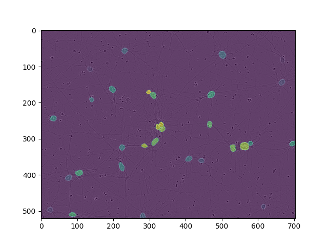

# Cell Instance Segmentation

<!-- TABLE OF CONTENTS -->
## Table of Contents
* [Performance](#evaluation-metric)
* [Pipeline](#pipeline)
* [Data](#data)
* [License](#license)

Follows from the Kaggle competition here:
https://www.kaggle.com/c/sartorius-cell-instance-segmentation

**Dependencies:** Pandas, Numpy, Matplotlib, SKLearn, SciPy, detectron2,
PyYAML, cv2, PyTorch, pycocotools, fastcore, joblib, and tqdm.

<!-- Performance -->
## Models Evaluated & Performance

### Evaluation Metric:

We evaluate the Precision of the IoU at different thresholds in the range 
[0.5, 1) and then took the Mean Average of each Precision to get the MAP 
IoU Score. 

NOTES: To understand the low AP scores at an IoU threshold of 0.9 consider 
reading this discussion:
https://www.kaggle.com/c/sartorius-cell-instance-segmentation/discussion/281205

**Transfer Trained on original data w/ NO Augmentations:**

| Model               | AP @ IoU 0.5 | AP @ IoU 0.75 | AP @ IoU 0.9 | MAP IoU @ [0.5, 1) | 
| ------------------- | ------------ | ------------- | ------------ | ------------------ |
| Mask R-CNN R50-FPN  | NONE         | NONE          | NONE         | NONE               | 
| Mask R-CNN R101-FPN | 0.537        | 0.206         | 0.003        | 0.255              | 

---

**Transfer Trained on LIVECELL first, then trained on competition specific data:**

| Model               | AP @ IoU 0.5 | AP @ IoU 0.75 | AP @ IoU 0.9 | MAP IoU @ [0.5, 1) | 
| ------------------- | ------------ | ------------- | ------------ | ------------------ |
| Mask R-CNN R50-FPN  | NONE         | NONE          | NONE         | NONE               | 
| Mask R-CNN R101-FPN | NONE         | NONE          | NONE         | NONE               | 


<!-- Pipeline -->
### Pipeline:

TODO

---

<!-- DATA -->
## Data:

```
sartorius-data
    ├── LIVECELL_dataset_2021/
    ├── test/
    ├── train/ 
    ├── train_semi_supervised/
    └── train.csv
```

Data in this competition was given in the form of Testing, Training, Train Semi
Supervised and LIVECELL Data. 

The Training, Testing, and Train Semi Supervised data consist of 3 cell types:
1. Astroctyes (astro)
2. SH-SY5Y (shsy5y)
3. Cort (cort)

The LIVECELL Data is a dataset containing 8 Cell Types, including the SH-SY5Y cell line
but not Astro or Cort cells. The SH-SY5Y data in the LIVECELL Data IS seperate from the
data we are given in the competition. The other 7 Cell Types in the LIVECELL Data are:
1. A172
2. BT474
3. BV-2
4. Huh7
5. MCF7
6. SkBr3
7. SK-OV-3


The extra data in the LIVECELL dataset will almost surely be utilized in training to 
acheive high scores on the Testing set, some ideas include:
    1. Adding the addition data from the SH-SY5Y cell line to the data in the Training set.
    2. First Training on the larger LIVECELL dataset then Transer Learning that model to the
    original training set. 


| Image Type     | SH-SY5Y                         | Astrocyte                      | Cort                          | 
| -------------- |:-------------------------------:|:------------------------------:|:-----------------------------:|
| Cell Images    |   |   |   |
| Actual Mask    |  |  |  |
| Predicted Mask |    |    |    |


---


<!-- LICENSE -->
## License

Distributed under the MIT License. See `LICENSE` for more information.


<br />


