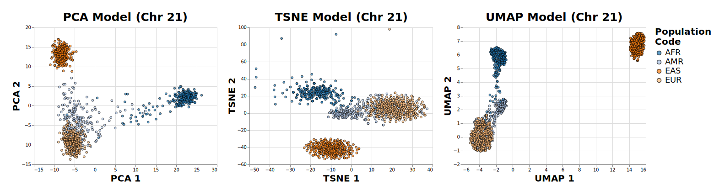

# Dimensionality Reduction on Genotypes

The goal of this project is to use common dimensionality reduction techniques
such as PCA, t-SNE, and UMAP to infer ancestery from individual genotypes.
Given that the genotype of any two individuals is roughly 99.9% alike, we would
like to pick out what is different (the variants) and do dimensionality
reduction on those parts of the genome. Today, we identify these variants
through a process called variant calling. In this project, the data is from the
1000 Genomes Project [[2]](#2) and is given in the form of a VCF (Variant Call
Format) file containing variants at various loci on an individual's
chromosome. Such variants inlcude single nucleotide polymorphisms (SNPs) or
structural variants (SVs) such as insertion/deletions (INDEL's) and more. 

<p align="center">
    
</p>


This project was inspired by Maria Nattestad's YouTube video and implementation
of this same project. Though this project is originally based off of this paper [[1]](#1),
all of which can be found in the following links:
 - *Original Paper*: https://www.ncbi.nlm.nih.gov/pmc/articles/PMC2735096/
 - *Maria Nattestad's YouTube Video*: https://youtu.be/-PCKK_nwFdA
 - *Maria Nattestad's GitHub Repo*: https://github.com/MariaNattestad/pca-on-genotypes


I will be using a different dataset than the original paper and a different chromosome 
of the same dataset than Maria Nattestad used in her implementation. If you are following 
along I also recommend you use a different dataset or the same dataset and a different 
chromosome than either Maria Nattestad (Chr 22) or I (Chr 21) used. This data is from the 
1000 Genomes Project [[2]](#2). The data I used can be downloaded via the following commands:

```
curl -O https://1000genomes.s3.amazonaws.com/release/20110521/ALL.chr21.phase1_release_v3.20101123.snps_indels_svs.genotypes.vcf.gz

curl -O https://1000genomes.s3.amazonaws.com/release/20110521/ALL.chr21.phase1_release_v3.20101123.snps_indels_svs.genotypes.vcf.gz.tbi

curl -O https://1000genomes.s3.amazonaws.com/release/20110521/phase1_integrated_calls.20101123.ALL.panel

curl -O ftp://ftp.1000genomes.ebi.ac.uk/vol1/ftp/phase3/20131219.populations.tsv
```

**NOTE**: If you want to use a different chromosome you can simply just change
where the first two downloads say chr21 to chrx where x is the number of the
chromosome [1, 22].


---

<!-- References -->
## References:

<a id = "1">[1]</a>: Novembre, J., Johnson, T., Bryc, K., Kutalik, Z., Boyko, A. R., Auton, A., Indap, A., King, K. S., Bergmann, S., Nelson, M. R., Stephens, M., & Bustamante, C. D. (2008). Genes mirror geography within Europe. Nature, 456(7218), 98–101. https://doi.org/10.1038/nature07331

<a id = "2">[2]</a>: 1000 Genomes Project Consortium, Auton, A., Brooks, L. D., Durbin, R. M., Garrison, E. P., Kang, H. M., Korbel, J. O., Marchini, J. L., McCarthy, S., McVean, G. A., & Abecasis, G. R. (2015). A global reference for human genetic variation. Nature, 526(7571), 6874. https://doi.org/10.1038/nature15393

---

<!-- LICENSE -->
## License

Distributed under the MIT License. See `LICENSE` for more information.


<br />


